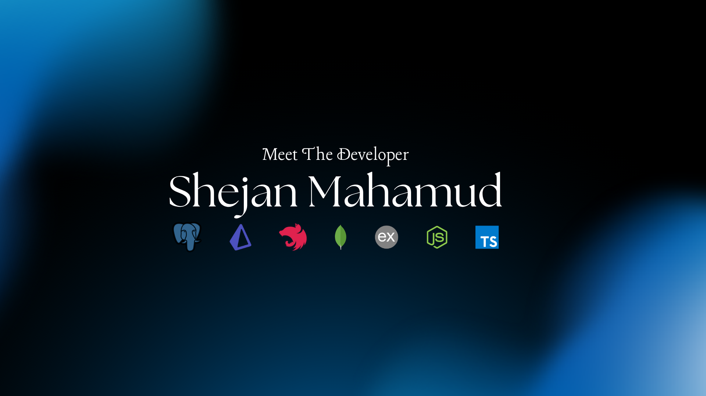

<h1 align="center">
  
</h1>

  
  
  
  

---

<h3 align="center">
  <samp>&gt; Hello, I’m <b>Shejan Mahamud</b> — a Backend-Focused Web Developer</samp>
</h3>

  🚀 Specializing in building scalable APIs, microservices, and SaaS platforms using <strong>Node.js, NestJS, TypeScript, PostgreSQL, and MongoDB</strong>.

---

## 👨‍💻 About Me

- 🧠 Deeply focused on backend engineering, API architecture & developer experience  
- 🔍 Learning advanced concepts in NestJS, Prisma ORM, and software architecture  
- 🛠️ Working on real-world SaaS platforms like <strong>Prompt Vault</strong> and <strong>DevERP</strong>  
- 💡 Passionate about automation, secure systems, and efficient backend patterns  
- ✍️ Sharing knowledge through blogs, open source, and dev tools  

---

## 💼 Tech Stack

### 🧩 Languages

### 🧪 Backend

### 🗄️ Database

### 🔐 Auth & Dev Tools

---

## 📌 Featured Projects

---

## 📚 Currently Learning

- NestJS Deep Dive (DI, Guards, Middleware, CQRS)
- PostgreSQL + Prisma optimization
- Microservice architecture + messaging
- Golang + backend testing

---

## ✍️ Recent Blogs

- 🔗 [Deploy Express App on Vercel + MongoDB](https://shejanmahamud.medium.com/how-to-deploy-an-express-app-on-vercel-with-mongodb-e64ba9a83f4f)  
- 💳 [SSLCOMMERZ Payment Gateway in Node.js](https://shejanmahamud.medium.com/integrating-sslcommerz-payment-gateway-in-node-js-1e0e7d1e2c70)  
- 🔐 [Secure React with Captcha](https://shejanmahamud.medium.com/securing-your-react-applications-with-react-awesome-captcha-a-complete-guide-e2f1a8e5c002)  

---

## 📈 GitHub Stats

### 🧠 Contribution & Commit Streak

  

### 🧾 Languages Used

  

### 🛡️ GitHub Stats

  

### 🏆 GitHub Trophies

  

---

### 📊 Contribution Graph

---

## 💬 Let’s Connect

📩 Email: **shejanmahamud@gmail.com**  
🤝 DM me on [**LinkedIn**](https://linkedin.com/in/md-shejanmahamud)  

---

  <samp><b>Crafting robust backends. One service at a time. ⚙️</b></samp>

