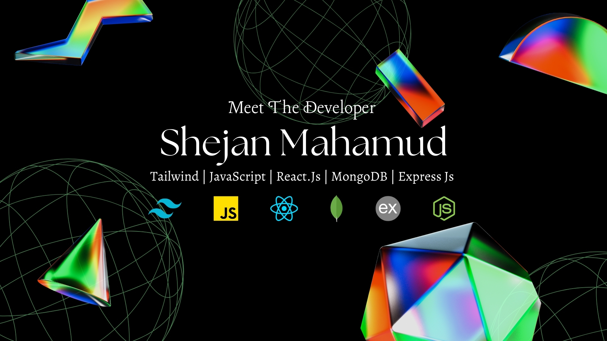

<h1 align="center">
  
</h1>

 
<!-- Intro  -->
<h3 align="center">
        <samp align='center'>&gt; Hey There!, I am
                <b><a target="_blank" href="https://shejanmahamud.netlify.app">Shejan Mahamud</a></b>
        </samp>
</h3>
 
<!-- About me -->

 
  <samp>
    <a>「 Front-End Developer | React.JS | NEXT.JS | MERN Stack 」</a>
<!--       https://g.co/kgs/Dnh2mD -->
     
  </samp>

 
  <samp>
    <a href="https://shejanmahamud.netlify.app">「 PORTFOLIO 」</a>
<!--       https://g.co/kgs/Dnh2mD -->
     
  </samp>

 
 
 
  

 

<!-- About Section -->

# 👀 Overview

 ✌️ &emsp; Enjoy to do programming, sharing knowledge & solving complex problems   
 ❤️ &emsp; Love to writing code and learning new technologies  
 ⚡ &emsp; Passionate about building scalable web applications and improving user experiences   
 🚀 &emsp; Skilled in full-stack development with expertise in MongoDB, Express, React, and Node.js   
 🔧 &emsp; Adept at using modern development tools and frameworks to streamline the development process   
 💬 &emsp; Always open to discussing new projects, creative ideas, or opportunities to be part of your visions  

 

## ⚡ Skills I Possess

## 🛠️ Tools I Possess

## ⌨️ Currently Learning

<a> 

 

## Open Source Project

  

 
 

  

 

## :book: Recent Blogs
- [Deploy an Express App on Vercel with MongoDB](https://shejanmahamud.medium.com/how-to-deploy-an-express-app-on-vercel-with-mongodb-e64ba9a83f4f)
- [Integrating SSLCOMMERZ Payment Gateway in Node.js](https://shejanmahamud.medium.com/integrating-sslcommerz-payment-gateway-in-node-js-1e0e7d1e2c70)
- [Securing React Applications with react-awesome-captcha](https://shejanmahamud.medium.com/securing-your-react-applications-with-react-awesome-captcha-a-complete-guide-e2f1a8e5c002)

 

<h3>Wanna Hear a Joke, Buddy? 😜</h3>

